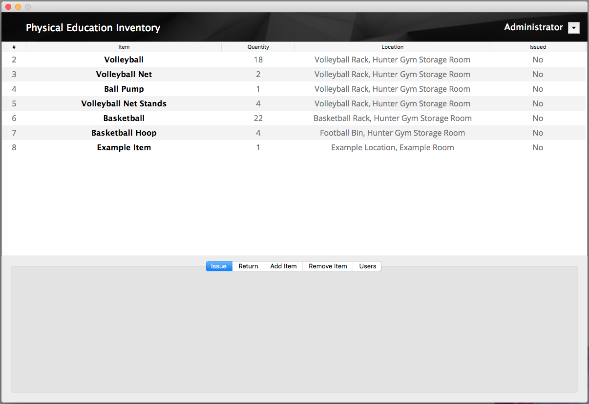

# Introduction
This is a software package to handle the Inventory of the Burnside High School P.E. Department.

# Installation
This package is current not able to be installed, as it requires a specific locally hosted database

# Main Features
- Encrypted login system with multiple users
- Multiple permission levels for different users
- GUI to lookup current inventory
- Panels to add and remove data from the database

# To-Do list
- User panel
- Issue panel
- Modify panel
- Individual user dropdown
- Convert to using AWS database
- Searchable and Sortable datatable
